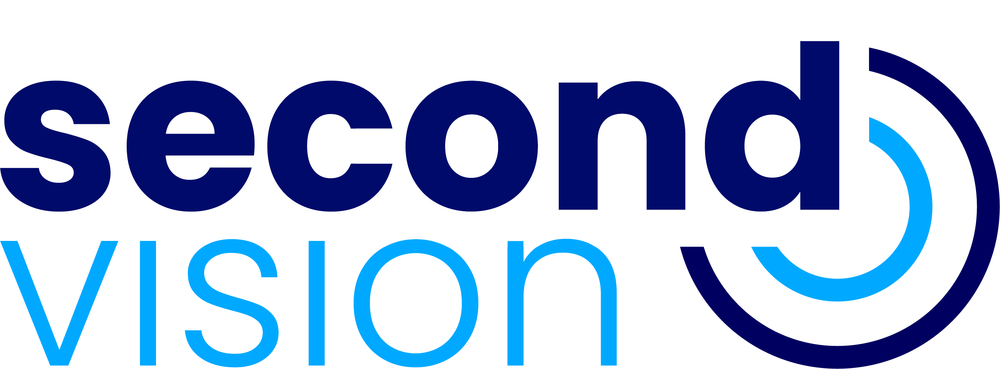

  

<h1 align="center">Second Vision</h1>

  <i>Uma nova forma de enxergar o mundo para aqueles que não o podem ver.</i>

  <a href="#-sobre-o-projeto">Sobre</a> •
  <a href="#-principais-funcionalidades">Funcionalidades</a> •
  <a href="#-tecnologias-utilizadas">Tecnologias</a> •
  <a href="#-instalação-do-servidor">Instalação</a> •
  <a href="#-jornada-e-reconhecimento">Jornada</a> •
  <a href="#%E2%80%8D-desenvolvedores">Equipe</a>

  
  
  

---

## 🌟 Sobre o Projeto

O **Second Vision** é uma plataforma de tecnologia assistiva de código aberto projetada para aumentar a autonomia e a segurança de pessoas com deficiência visual. O sistema consiste em um dispositivo vestível, baseado em um microcomputador Raspberry Pi, que utiliza visão computacional e inteligência artificial para identificar obstáculos e ler textos em tempo real, comunicando as informações ao usuário através de um aplicativo mobile acessível.

O que começou como um Trabalho de Conclusão de Curso na **Etec Zona Leste** evoluiu para um projeto robusto de tecnologia e impacto social. Hoje, em desenvolvimento na **Fatec Zona Leste**, o projeto continua a crescer, impulsionado por uma arquitetura técnica avançada e parcerias significativas.

## ✨ Principais Funcionalidades

O sistema foi projetado para ser flexível e poderoso, adaptando-se às necessidades do usuário e às condições do ambiente.

-   **Detecção de Objetos e Textos:** Identifica obstáculos urbanos e lê textos em placas, embalagens e documentos.
-   **Arquitetura Híbrida (Local + Nuvem):**
    -   **Modo Offline:** Utiliza processamento embarcado para detecções essenciais, garantindo funcionamento contínuo sem internet.
    -   **Modo Online:** Conecta-se a APIs de nuvem para obter detecções com maior precisão e uma gama mais ampla de objetos e textos.
-   **Hardware Adaptável:**
    -   **Versão V5 (Raspberry Pi 5):** Dispositivo de alta performance com capacidade total de processamento offline (objetos e texto).
    -   **Versão V0 (Raspberry Pi Zero 2 W):** Dispositivo de baixo custo e ultraportátil que utiliza uma Câmera com IA para detecção de objetos offline, complementado pelo processamento de texto na nuvem.
-   **Design Inclusivo:**
    -   **Aplicativo Acessível:** Interface desenvolvida com foco em acessibilidade, utilizando feedback por voz para comunicar informações de forma clara e intuitiva.
    -   **Case Ergonômica:** O hardware é acondicionado em uma case impressa em 3D com inscrições em Braille, pensada para usabilidade e conforto.
-   **Comunicação Eficiente:** Utiliza **Bluetooth Low Energy (BLE)** para uma conexão de baixo consumo de energia entre o dispositivo e o smartphone.

## 🚀 Tecnologias Utilizadas

O projeto integra tecnologias de ponta em hardware embarcado, IA e desenvolvimento mobile.

#### Servidor (Raspberry Pi)
-   **Linguagem:** Python
-   **Comunicação BLE:** Servidor GATT implementado com `dbus-python` para interagir com o daemon BlueZ do Linux.
-   **IA Local (Offline):**
    -   **Detecção de Objetos:** YOLOv8
    -   **OCR (Reconhecimento Óptico de Caracteres):** PaddleOCR
-   **IA na Nuvem (Online):** Integração com APIs de Visão Computacional (ex: Azure Computer Vision).
-   **Gerenciamento de Rede:** `NetworkManager` controlado via script para alternância dinâmica entre os modos online e offline.
-   **Hardware:** Raspberry Pi 5 / Zero 2 W, Câmera com IA, UPS HAT com sensor INA219.

#### Aplicativo Cliente (**Publicado na [Play Store](https://play.google.com/store/apps/details?id=com.rotech.ble_connection&pcampaignid=web_share)**)
-   **Framework:** React Native (Expo)
-   **Linguagem:** TypeScript
-   **Comunicação BLE:** `react-native-ble-plx`
-   **Síntese de Voz:** `expo-speech`

## 📦 Instalação do Servidor

Para configurar o ambiente do servidor em um Raspberry Pi, siga as instruções detalhadas no nosso **[Guia de Instalação do Servidor RaspBerry PI 5](https://github.com/second-vision/Second-Vision/blob/GattServerV5/README.md)** ou **[Guia de Instalação do Servidor RaspBerry PI Zero 2W](https://github.com/second-vision/Second-Vision/blob/GattServerV0/README.md)**

## 🏆 Jornada e Reconhecimento

O Second Vision é um projeto com uma trajetória de crescimento e validação contínua por instituições de renome.

-   **Origem:** Nascido como um TCC na **Etec Zona Leste**.
-   **Mentoria:** Recebeu mentoria e apoio da **IBM** e da **Fundação IOCHPE**, que ajudaram a moldar a visão técnica e de produto.
-   **Evolução Acadêmica:** Atualmente em desenvolvimento na **Fatec Zona Leste**, com a publicação de um **artigo científico** em andamento.
-   **Expositor na FETEPS:** Selecionado como projeto expositor na **16ª FETEPS (Feira Tecnológica do Centro Paula Souza)**, conquistou a segunda colocação no ranking geral, um reconhecimento da sua inovação e impacto.
-   **Interesse Institucional:** O projeto despertou o interesse do **SUS** e do **Ministério da Saúde** como uma potencial ferramenta de tecnologia assistiva, com discussões em andamento para apoio e desenvolvimento da ideia.

## 👨‍💻 Desenvolvedores

Obrigado pela dedicação e foco de todos os envolvidos nesta jornada!

| [ Gustavo Mendes Ventieri Mariano](https://github.com/gustavoventieri/) |  [ Nickolas Maia de Araujo](https://github.com/nickolss)  |  [ Pedro Fernandes Araújo](https://github.com/PedroFAraujo) | [ Tiago Bryan Ramos de Oliveira](https://github.com/TiagoBryan) |
| :---: | :---: | :---: | :---: |

---
